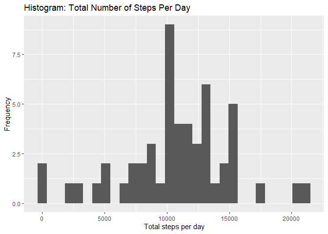
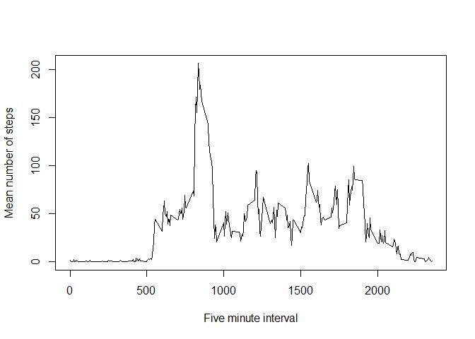
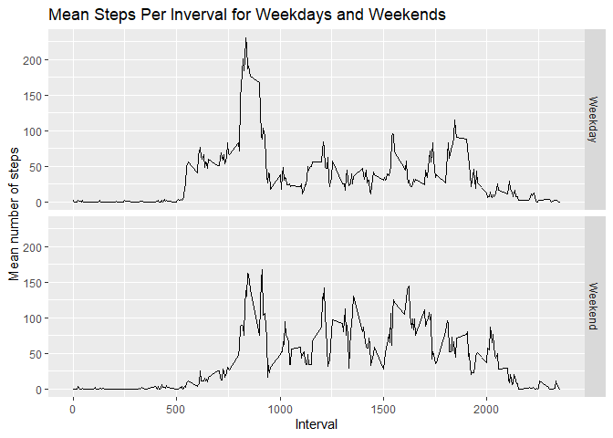

## Loading and preprocessing the data

```r
#Directory is Reproducible Research
#Check if a data folder exists, and if not, Create one

if(!file.exists("data")){
        dir.create("data")
}

#unzip data folder from repo clone and save data in data folder
zipfile <- "./RepData_PeerAssessment1/activity.zip"
unzip(zipfile, exdir = "./data", unzip = "internal")
list.files("./data")
```

```
## [1] "activity.csv"
```

```r
# Load .csv into R
activity <- read.csv("./data/activity.csv", header = TRUE)

#Check structure of data
str(activity)
```

```
## 'data.frame':	17568 obs. of  3 variables:
##  $ steps   : int  NA NA NA NA NA NA NA NA NA NA ...
##  $ date    : chr  "2012-10-01" "2012-10-01" "2012-10-01" "2012-10-01" ...
##  $ interval: int  0 5 10 15 20 25 30 35 40 45 ...
```

```r
#Covert date variable to date format
activity$date <- as.POSIXct(activity$date, format="%Y-%m-%d")
```


## What is mean total number of steps taken per day?

```r
#Calculate total, mean total and median steps per day 
activity_na.rm <- activity %>% 
    ungroup %>% 
    filter(!is.na(steps)) %>% 
    group_by(date) %>% 
    summarize(step_day = sum(steps, na.rm=TRUE))

activity_m <- activity_na.rm %>% 
    summarise(mean_step = round(mean(step_day),0),
              median_step = median(step_day))
           

#Extract total as a single value
total_step <- sum(activity$steps, na.rm=TRUE)

#Extract dates, the count number of unique dates
dates <- unique(activity$date)
day_n <- c(1:length(dates))

#Divide total steps over all days by number of days to get mean total
total_mean_step <- round(total_step / max(day_n),0)
```

The total number of steps taken over all days recorded is per day is 570608. The mean number of steps per day is 10766 and the median number of steps per day is 10765.

The histogram below shows the total number of steps per day.

```r
step_hist <- ggplot(data = activity_na.rm, aes(step_day, na.rm=TRUE)) 
    step_hist + geom_histogram() + 
    labs(title = "Histogram: Total Number of Steps Per Day",
         x = "Total steps per day",
         y = "Frequency")   
```

<!-- -->


## What is the average daily activity pattern?

The average daily step pattern is shown in the graph below. This is calculated by matching the five minute intervals for each of the days recorded and calculating the mean number of steps for each interval. This shows that the highest number of steps typically occurs around the 10,000th interval each day. 


```r
#Calculate mean steps per interval across days
activity_interval <- activity %>% 
    group_by(interval) %>% 
    summarise(int_mean = mean(steps, na.rm= TRUE))

plot(int_mean ~ interval, data=activity_interval,
     type = "l", 
     xlab = "Five minute interval",
     ylab = "Mean number of steps")
```

<!-- -->
In the previous calculations, missing values were removed. This limits the amount of information used for analysis and can introduce bias in results. Another analytic approach is to impute the missing values and assess whether this impacts overall results. This approach is explored below. 

## Imputing missing values


```r
#Count missing values in steps variable
missing <- sum(is.na(activity$steps))
```
The total number of missing values for the 'steps' variable is 2304.


```r
activity_na.rp <- activity %>% 
    group_by(interval) %>% 
    mutate(int_mean = mean(steps, na.rm= TRUE),
           steps = ifelse(is.na(steps), int_mean, steps)) %>% 
    ungroup %>% 
    mutate(total_step = sum(steps),
           med_step = round(median(total_step),0),
           mean_step = round(mean(total_step),0))


#Extract total as a single value
total_step_na.rp <- round(max(activity_na.rp$total_step),2)

#Divide total steps over all days by number of days to get mean total
total_mean_step_na.rp <- round(total_step_na.rp / max(day_n),2)

#Extract median
median_step_na.rp <- max(activity_na.rp$med_step, na.rm=TRUE)

#Extract mean
mean_step_na.rp <- max(activity_na.rp$mean_step, na.rm=TRUE)
```

When missing values are imputed using the mean from each daily interval, the total number of steps for the full reporting period increases from 570608 to 656737.5. This is an increase of 86129.51 steps, if missing values are replaced with mean values. 

## Are there differences in activity patterns between weekdays and weekends?


```r
activity_wk <- activity_na.rp %>%
    mutate(day = weekdays(as.Date(date)), 
           wkday = ifelse(day == "Monday" |
                             day == "Tuesday" |
                             day == "Wednesday" |
                             day == "Thursday" |
                             day == "Friday", "Weekday", "Weekend")) %>% 
    mutate(wkday = as.factor(wkday)) %>% 
    group_by(interval, wkday) %>% 
    mutate(wkday_int_mean = round(mean(steps),0))


step_wk <- ggplot(data = activity_wk, aes(interval, wkday_int_mean)) 
    step_wk + geom_line() + 
    facet_grid(rows = vars(wkday)) +
    labs(title = "Mean Steps Per Inverval for Weekdays and Weekends",
         x = "Interval",
         y = "Mean number of steps")      
```

<!-- -->

```r
activity_wk_max <- activity_wk %>% 
    group_by(wkday) %>% 
    summarise(step_max = max(wkday_int_mean))
```
The above graphs show the average daily activity routine for weekdays and weekends. The plots indicate that activity starts later on weekends, as compared to weekends. Furthermore, on weekdays, the highest mean number of steps per interval 230, whereas on weekends, the highest mean number of steps is `r min(activity_wk_max$step_max).
